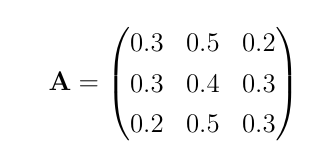

# Using the Chapmann-Kolmogorov relation

In previous exercises you learned how we can estimate the n-step transition probablity matrix from the 1-step transition probability matrix for a Markov chain by sampling.  There is an easier way to calculate the n-step transition probablity matrix, however.  We can exploit the Chapmann-Kolmogorov relationship which gives us the following relationship between the n+m step transition probablity matrix and the n and m step transition probability matrices:


This relationship essentially tells us that the n step transition probablity matrix is equal to the nth power of the 1-step transition probablity matrix.

You can calculate the `n`th power of a matrix, `A`, in python by using the following command:

````
matpow = np.linalg.matrix_power( A, n )
`````

Furthermore, you can set the matrix `A` using the `np.array` command that we have learned about elsewhere.

Your task in this exericse is thus to set a variable called `A` equal to the following 1-step transition probablity matrix.



You must then set the variables `A2`, `A10`, `A50` and `A100` equal to the 2, 10, 50 and 100 step transition probablity matrices respectively.
